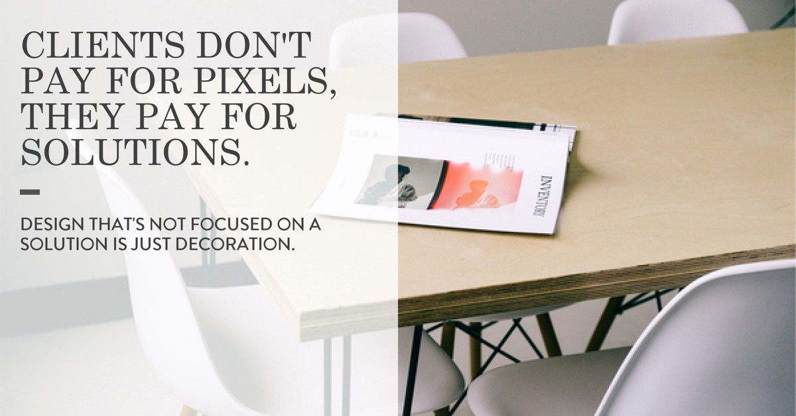

Let me start by stating that I’m not a fan of the ridiculous job titles that many people in my industry claim. Let’s chill with the “Design Guru, Creative Evangelist, and VP of Awesomesauce (or whatever)” job titles. When it comes to designer job titles, part of me wants to side with people like Mike Monteiro and the idea that we are all just designers, we design things, we don’t need fancy titles other than “Designer.” But by introducing yourself to someone as a designer, the only thing you’ve told them is you can probably put together a matching outfit. On the flip-side, keeping things generic can be a security blanket. Even if it’s just one of those blankets that’s too scratchy and never keeps you at a comfortable temperature.

### Titles, or Pigeonholes?

If my daughter’s got the flu, I don’t take her to a Geriatric Podiatrist, I take her to a Pediatrician. Because she’s not 70. And her feet are fine. Job titles tend to pigeonhole people in any industry, and sometimes this can be a good thing—like if you’re a 70-year-old woman needing a foot doctor. But in the design world, it’s not quite as black and white. Many of us have a wide range of skills and shift from one type of project to another as needed. And the rest of us might love with doing a single type of work and only want to mess with those projects. I know people that only do logo design, or only do book cover design. For my comrades in this second category, a specific title like Logo Designer might be perfect. So where does that leave me?

### The Journey to UX Designer

For a long time, I didn’t want to lock myself into only one type of design role and the blanket “designer” title didn’t tell you anything, so I didn’t know what to call myself. Then I discovered “UX Designer” and it seemed the most—technically—accurate. That’s User Experience for the uninformed people in the room. Let’s look at Wikipedia for some wisdom.

> User Experience Design (UXD or UED or XD) is the process of enhancing user satisfaction by improving the usability, accessibility, and pleasure provided in the interaction between the user and the product.

What I take from that is that a UX Designer’s goal is to focus on the end-user. I know, I’m super smart like that. To make things easier, more enjoyable, and more accessible for people. Basically, to bring good into the world. Shouldn’t that be every designer’s mission in life? So UX Designer, it was.

### Peas and Carrots

Wait, what if your focus is not just on the end-user, but also on the client’s goals, budget, and timeline? What if your focus is also on being efficient or working cohesively with copywriters and developers? What if you also take a thoughtful approach to how the copy will affect the person visiting the site and handle a large portion of the front-end development yourself? After all, good copy, front-end dev, and visual design go together like peas and carrots. It’s all about effective communication, baby! Now we are bridging the gaps between design (customer avatars, emotion, brand messaging) and development (hard facts, media queries, efficiency.)

Enter, the Full-Stack Designer.

## Full-Stack… What?

The term “Full-Stack” has been around for a minute. It’s what we’ve been calling developers that are comfy working with the full… stack… of development technologies. I’m not going to get into the specifics here, that’s not the point and I would embarrass myself on the details. The point is that somebody was smart enough to recognize that having a someone around that could jump between tasks or step back and look at the bigger picture was valuable. Not that they are experts at everything (a.k.a. unicorns) but that they are flexible. I think it’s a great distinction, I’m just not sure why the design community waited so long to rip it off.

### Full-Stack Designer

The consensus is that a full-stack designer would be someone who takes the UX-centric design mentality and marries it with the front-end dev process. Really, I think it should go a little further. I consider a full-stack designer to be someone who can look at the bigger picture and solve problems from multiple angles. Someone who has a range of experiences to pull from in the creation process but also uses research and data as part of their toolset. Someone who can understand a clients needs/wants and budget while also understanding the practical limitations that those things place in the overall process. This is why learning about development is so valuable to us as designers.

## Why you should actually care about any of this

Clients don’t pay for pixels, they pay for solutions. Design that’s not focused on a solution, is just decoration. We have to be problem solvers. But before we can solve any problems, we first need to understand what they are.

* Learning about business strategy and how to figure out what your client’s motivations are, helps uncover what their real goals are—the ones that are not in the bullet list on your design brief, but the ones that make them so defensive when you mention their logo.
* Knowing how to read data and get feedback from users helps figure out what will speak to their audience.
* Learning at least the basics of SEO can help you create a design that will play nice with the search engines.
* Understanding what goes into the development process will make you a lot more equipped to manage your time, give your clients a timeline that actually works, and keep the entire cost of the project within budget.
* As a bonus, being able to make edits to your code can make things move A LOT faster. You no longer have to play email tag to change a font or a color.

Good design is all about communication. Communicating with your client, helping them communicate with their customer, and with everyone else around the table that are necessary to make the project a success. They all bring with them different motivations, concerns, and ideas of what success looks like. It’s our job to translate. It’s not always the easiest job in the world, but easy isn’t really what you signed up for, is it?
